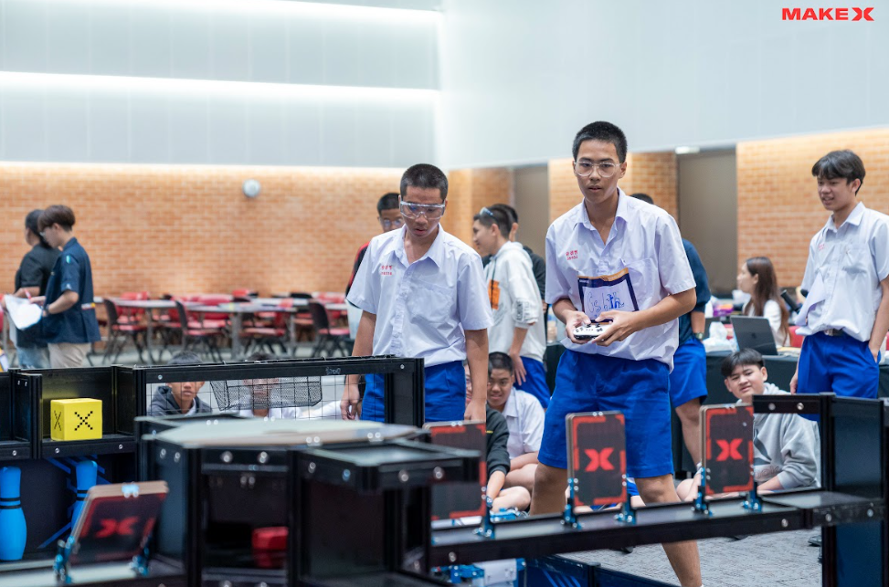
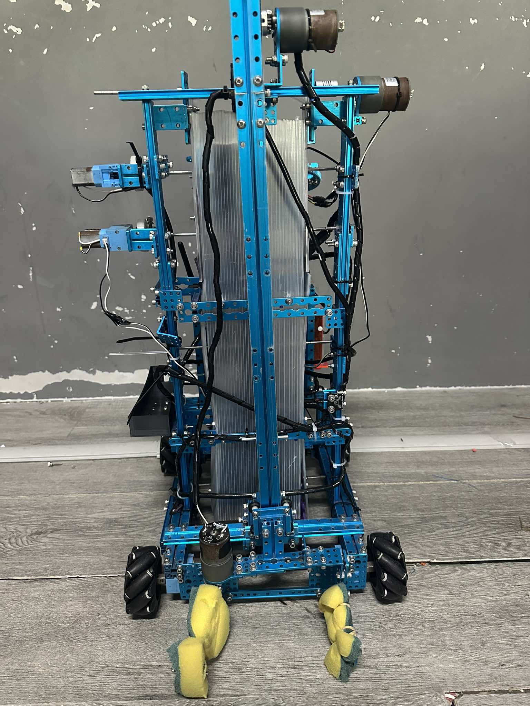
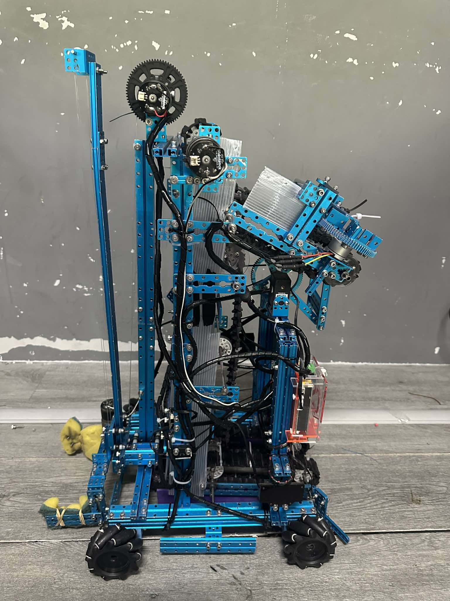
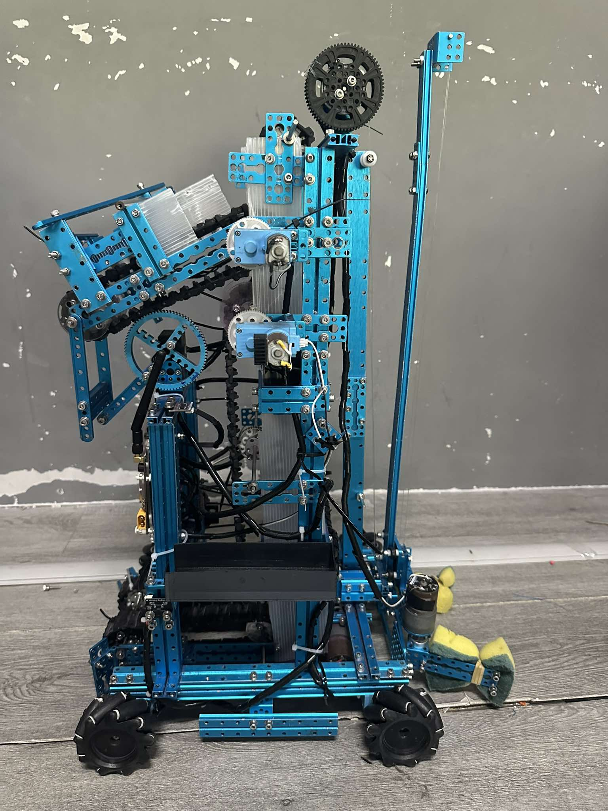

</img>
## [🤖MakeX Challenge 2024](https://www.youtube.com/watch?v=AydWgBX8IwI&t=6s)
* It is a robot competition format that promotes learning in the form of STEM education in the 21st century that is more than just a robot competition to win, but also inspires being a creator or inventor, problem solving and teamwork.
#
## • 🏆Achievements 2023 - 2024 | Computer - Science 6 th , ACS

* 🥈 First - Runner Up : 2023 MakeX Thailand National Championship Competition
* 🏆 Champion : ACR Academic day : 60th Anniversary Of ACR : Royal Trophy 2023 
* 🥉 Second - Runner Up : 2024 ACT MakeX Robotics Invitation 2024 : Warm Up 2024
* 🥈 First - Runner Up :  ACS Lifelong Learning & Education Expo 2024 : Royal Trophy 2024 

#
## • 👯 Member Of Cs6th 2024
  ### [ Tryn Sirineth (Tanguy)](https://www.instagram.com/_t.sirineth_/)

     • Controller

     • Mechanic

  ### [ Pollapat Rattanapol (Au)](https://www.instagram.com/pollapat.ax/)

     • Programmer

     • Scout

     
#
## • 💻 Program
* [V.19.01 (ACT Warm Up)](Program/V.19.01.py)

* [V.20.01 (Main)](Program/V.20.01.py)

#

## • 🪄 Model from Cs6th
* [Battery Box(Low Weight)](Model/Battery%20Box.stl)
* [Belt01](Model/Belt01.svg)
* [Belt02](Model/Belt02.svg)
* [Gear](Model/Gear.stl)
* [Gripper](Model/Gripper.stl)
* [Storage01](Model/Storage01.stl)
* [Storage02](Model/Storage02.stl)
* [Storage03](Model/Storage03.stl)
* [Storage04](Model/Storage04.stl)
* [Storage05](Model/Storage05.stl)
* [China](Model/MakeX%20China.stl)
#

## • 🤖  Structure
### • Front
   

### • Back
   

### • Right
   

### • Left
   
#

